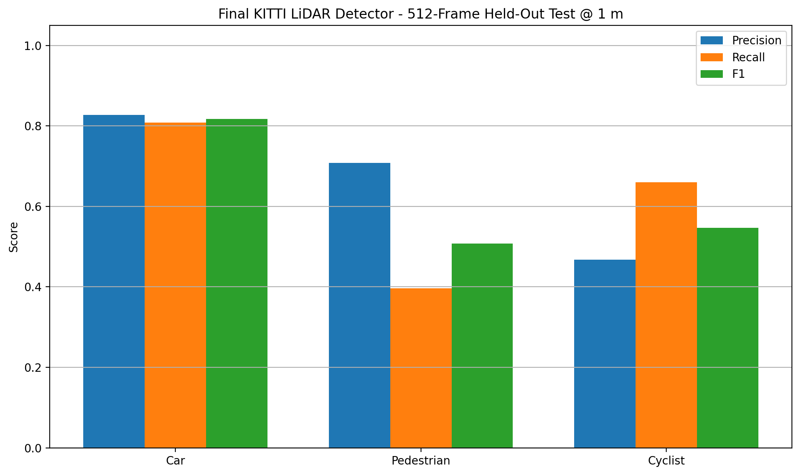
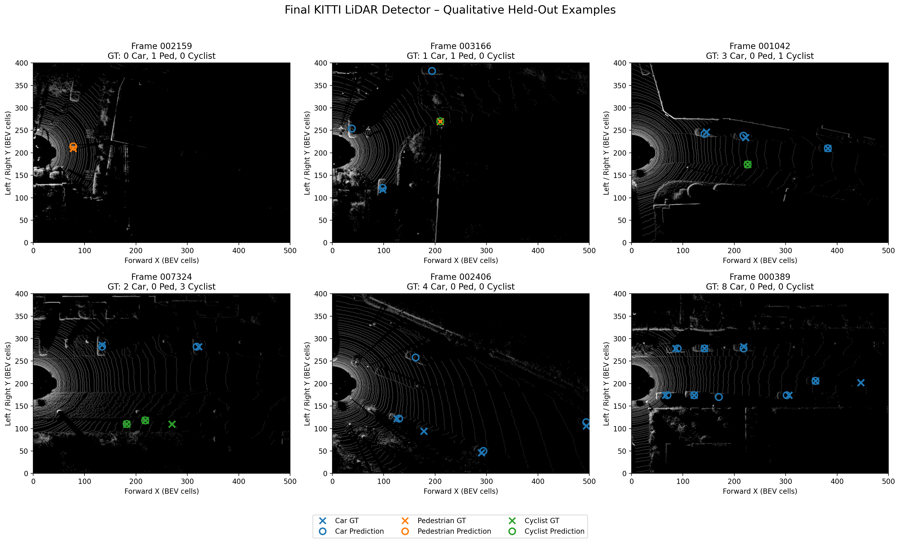

# KITTI LiDAR BEV Object Center Detection

A LiDAR-based object-detection project using the KITTI dataset, bird's-eye-view (BEV) feature maps, and a lightweight PyTorch convolutional neural network.

The project develops the full pipeline from raw Velodyne point clouds through preprocessing, classical clustering, BEV construction, neural-network training, class-imbalance handling, validation-based model selection, and final held-out evaluation.

## Project Overview

The detector predicts BEV object centers for three KITTI road-user classes:

- Car
- Pedestrian
- Cyclist

The project includes two main approaches:

1. **Classical baseline**
   - LiDAR region-of-interest cropping
   - RANSAC ground-plane removal
   - voxel downsampling
   - DBSCAN clustering
   - geometric filtering

2. **Neural BEV detector**
   - three-channel BEV representation
   - height, intensity, and density features
   - stride-4 convolutional center-heatmap detector
   - focal-loss training
   - class-aware weighted sampling
   - validation-based confidence-threshold selection

## Main Notebook

The complete cleaned notebook is:

`LiDAR_KITTI_Project_GitHub.ipynb`

It contains the full experimental workflow, visualizations, training methodology, validation analysis, final held-out evaluation, and qualitative examples.

## BEV Representation

The LiDAR point cloud is projected into a three-channel BEV tensor containing:

- height
- intensity
- point density

| Parameter | Value |
|---|---:|
| BEV input size | 500 × 400 |
| Detector output size | 125 × 100 |
| Output stride | 4 |
| Output-cell resolution | 0.4 m |
| Classes | Car, Pedestrian, Cyclist |

## Training Strategy

The initial neural detector was trained on 256 frames.

Class-frequency analysis showed substantial imbalance, particularly for pedestrian and cyclist examples. A class-aware weighted sampler was therefore introduced to increase minority-class exposure.

Training was then expanded to:

- **2,000 training frames**
- **64 frozen validation frames**
- **256-frame development benchmark**
- **512-frame final held-out evaluation split**

The 512 final evaluation frames were excluded from training, validation/model selection, confidence-threshold tuning, and the earlier development benchmark.

## Effect of Scaling the Training Set

Validation F1 at a 1.0 m center-matching tolerance improved substantially after scaling from 256 to 2,000 training frames.

| Class | 256-Frame F1 | 2,000-Frame F1 |
|---|---:|---:|
| Car | 0.747 | 0.813 |
| Pedestrian | 0.351 | 0.625 |
| Cyclist | 0.250 | 0.595 |

The largest gains occurred for the minority pedestrian and cyclist classes.

## Validation-Selected Thresholds

Confidence thresholds were selected using only the frozen validation split and then fixed before the final held-out evaluation.

| Class | Threshold |
|---|---:|
| Car | 0.40 |
| Pedestrian | 0.56 |
| Cyclist | 0.34 |

## Final Held-Out Evaluation

The selected model was evaluated once on the locked 512-frame held-out evaluation split.

Evaluation uses score-ordered one-to-one matching with a **1.0 m center-distance tolerance**.

| Class | Precision | Recall | F1 | Mean Localization Error |
|---|---:|---:|---:|---:|
| Car | 0.827 | 0.808 | 0.817 | 0.206 m |
| Pedestrian | 0.708 | 0.396 | 0.508 | 0.074 m |
| Cyclist | 0.467 | 0.660 | 0.547 | 0.099 m |

Overall performance:

| Metric | Precision | Recall | F1 |
|---|---:|---:|---:|
| Micro | 0.792 | 0.750 | 0.771 |
| Macro | 0.667 | 0.621 | 0.624 |

## Final Performance Figure



## Qualitative Examples

Qualitative examples were selected using **ground-truth class presence only**. Model predictions were not used to choose favorable examples.



The visualization uses:

- `×` — KITTI ground-truth object center
- `○` — predicted object center
- Blue — Car
- Orange — Pedestrian
- Green — Cyclist

## Repository Structure

```text
Lidar_Project/
├── LiDAR_KITTI_Project_GitHub.ipynb
├── README.md
├── .gitignore
└── experiment_data/
    ├── baseline_experiment.json
    ├── expanded_train_2000_frames.txt
    ├── final_test_512_frames.txt
    ├── final_test_metrics_512.png
    ├── final_test_results_512.json
    ├── qualitative_example_frames.txt
    ├── qualitative_final_test_examples.png
    ├── selected_model_thresholds.txt
    ├── test_frames.txt
    ├── train_frames.txt
    └── validation_frames.txt
```

The historical file `experiment_data/test_frames.txt` contains the earlier **256-frame development benchmark**, not the final held-out evaluation split.

The final 512-frame split is stored separately as `experiment_data/final_test_512_frames.txt`.

## Dataset

The KITTI dataset is **not included** in this repository.

The notebook expects the KITTI training data under `Data/training/`, with the standard KITTI folders such as:

- `Data/training/velodyne/`
- `Data/training/label_2/`
- `Data/training/calib/`

Because of dataset size and licensing considerations, the `Data/` directory is excluded through `.gitignore`.

## Model Checkpoints

Trained model checkpoints are stored locally under `checkpoints/`.

The checkpoint directory is excluded from GitHub through `.gitignore`.

The final selected model used for the reported results is:

`stride4_bev_detector_2000_balanced_best.pt`

## Environment

The project was developed using:

- Python 3.10
- PyTorch 2.7
- CUDA-enabled GPU training
- NumPy
- Matplotlib
- scikit-learn

The experiments were run on an NVIDIA GeForce GTX 1650 GPU with 4 GB VRAM.

## Important Evaluation Note

This project predicts **BEV object centers**, not full oriented 3D bounding boxes.

The reported Precision, Recall, F1, and localization-error values are custom center-detection metrics using a **1.0 m matching tolerance**.

They are **not official KITTI 2D, BEV, or 3D Average Precision (AP) benchmark results**.

The train, validation, development-benchmark, and final held-out splits were sampled from frames containing at least one Car, Pedestrian, or Cyclist annotation. Background-only frames are therefore not represented in the reported evaluation.

Localization errors are measured on the stride-4 BEV target grid, corresponding to **0.4 m per output cell**, rather than directly against continuous KITTI 3D box-center coordinates.

## Key Findings

- Scaling training from 256 to 2,000 frames improved all three object classes.
- Class-aware sampling substantially improved learning for pedestrian and cyclist examples.
- Car detection achieved the strongest balance between precision and recall.
- Pedestrian detections were relatively precise but had lower recall.
- Cyclist detection achieved higher recall but produced more false positives.
- The final detector achieved a **0.771 micro F1** and **0.624 macro F1** on the locked 512-frame held-out evaluation split.

## Future Work

Possible extensions include:

- full oriented 3D bounding-box prediction
- official KITTI AP evaluation
- improved pedestrian and cyclist recall
- additional data augmentation
- stronger BEV backbones
- temporal LiDAR fusion
- evaluation on background-only scenes
- comparison with modern point-cloud detection architectures

## Dataset Notice

KITTI data is not redistributed with this repository. Users should obtain the dataset from the official KITTI source and follow its licensing terms.
